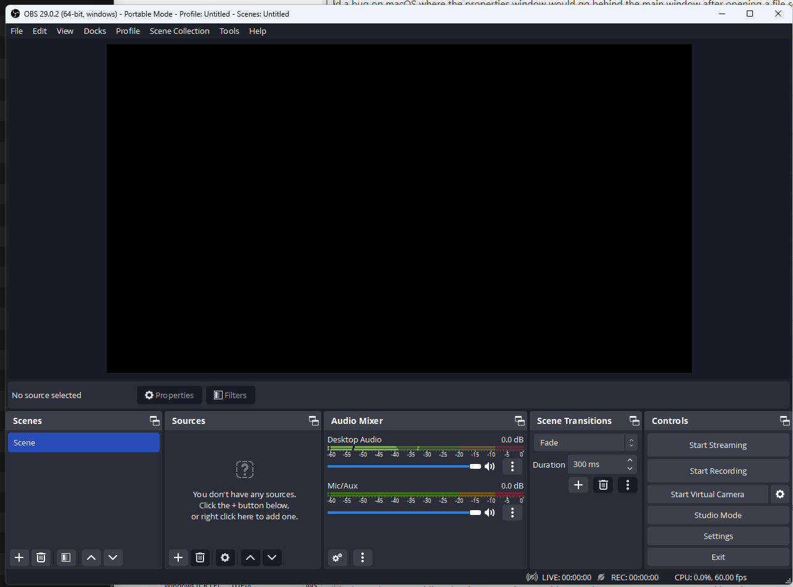
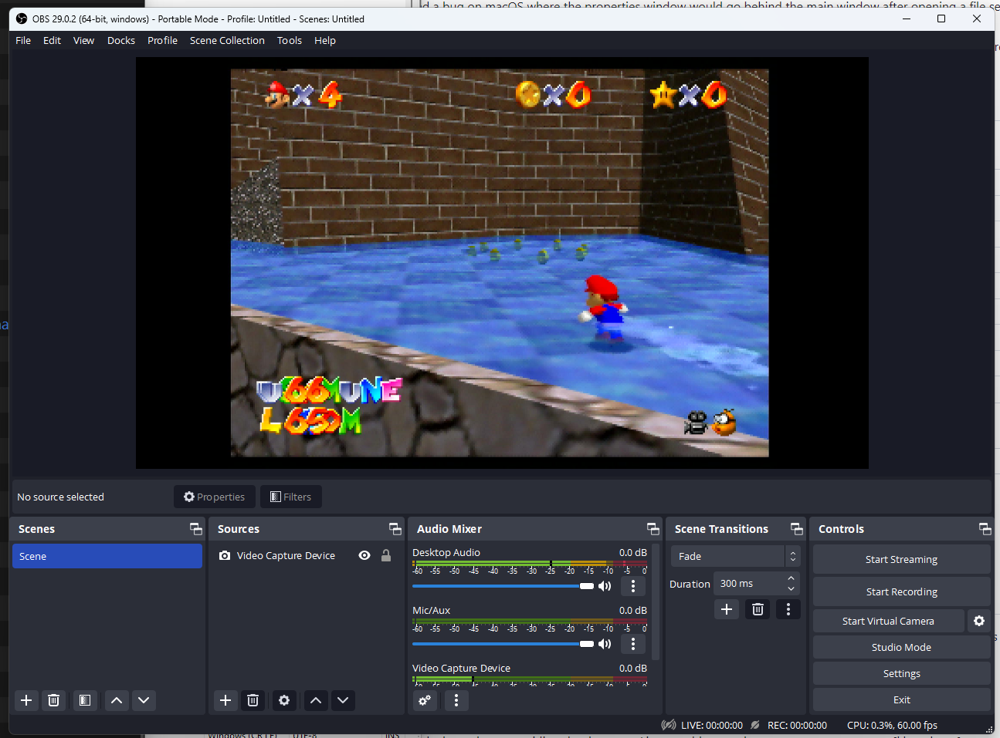
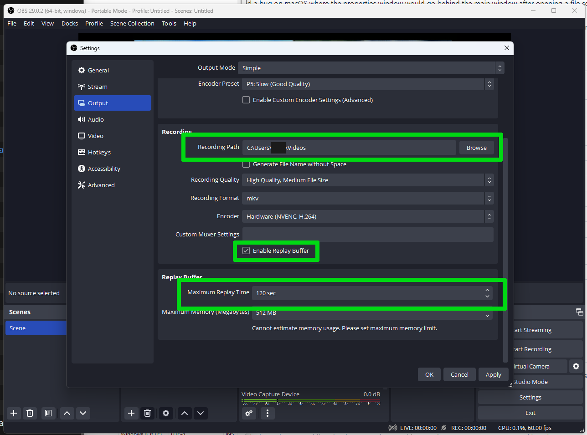
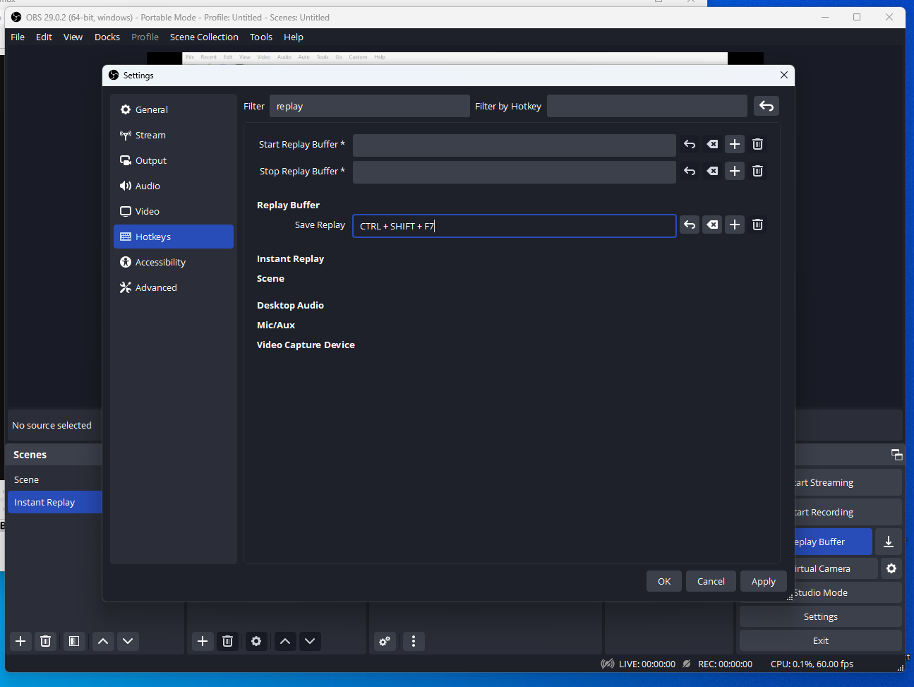
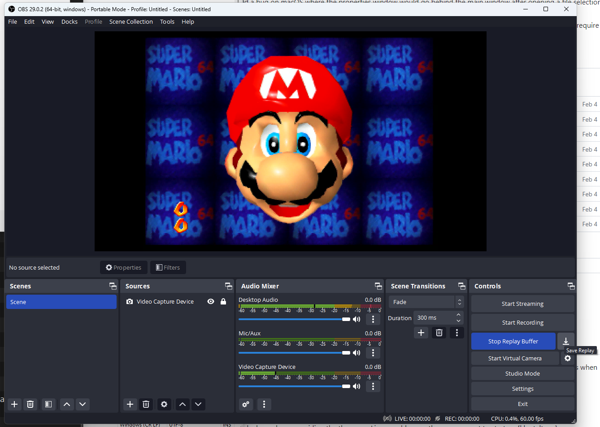
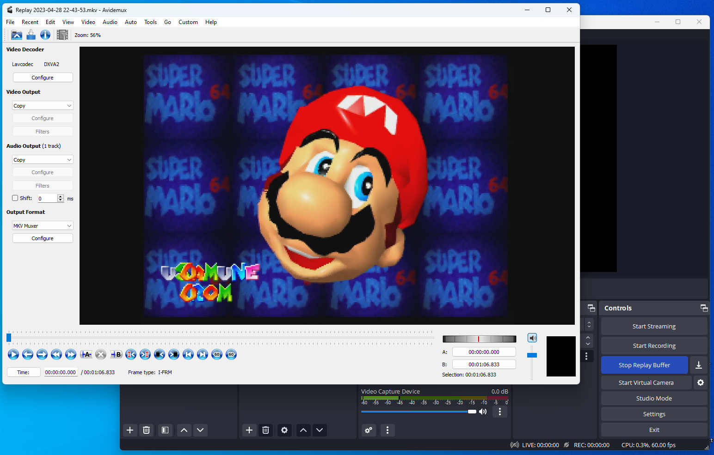
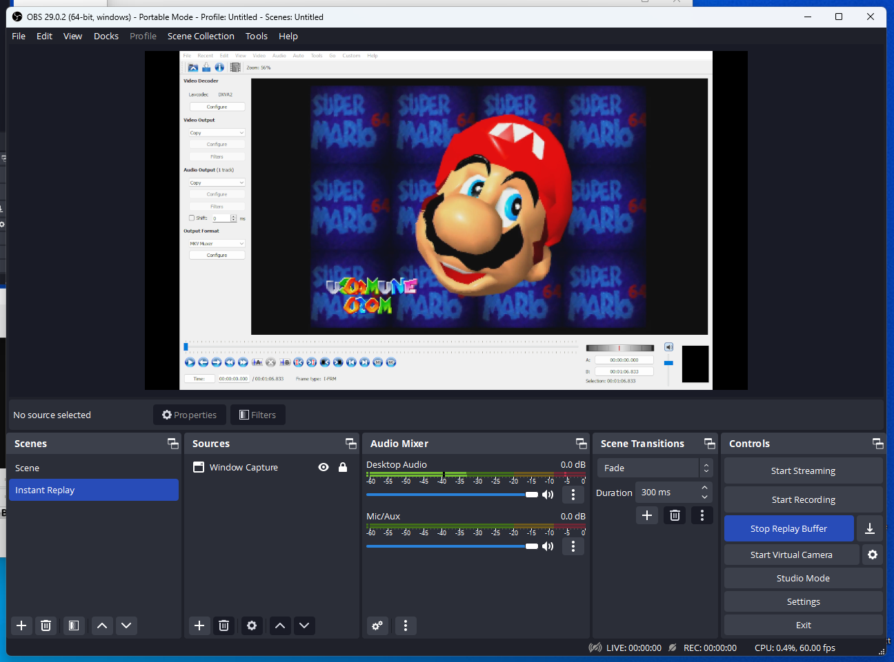
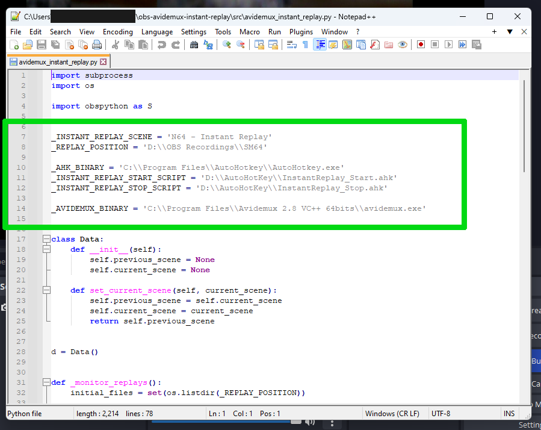
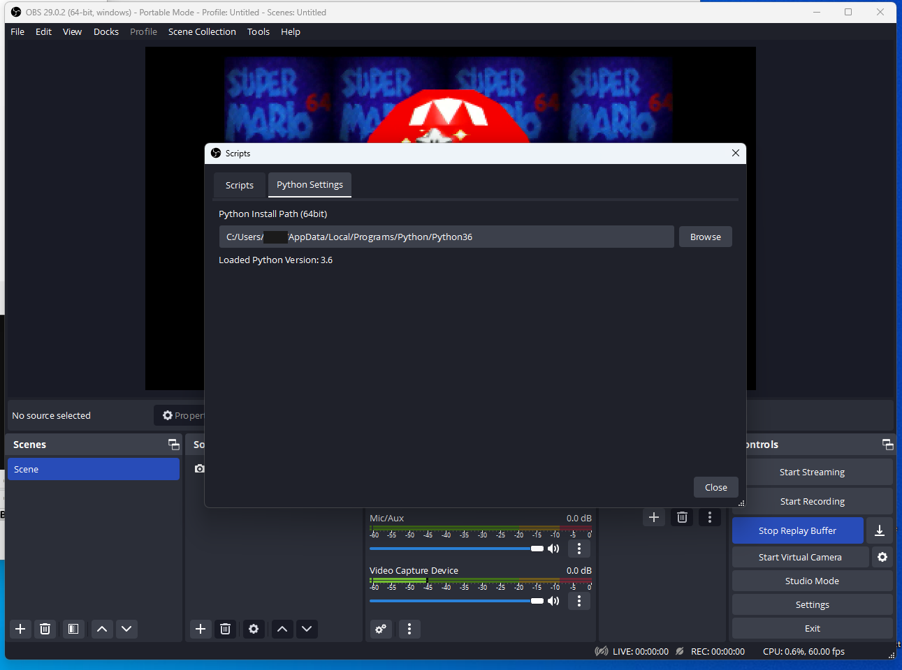
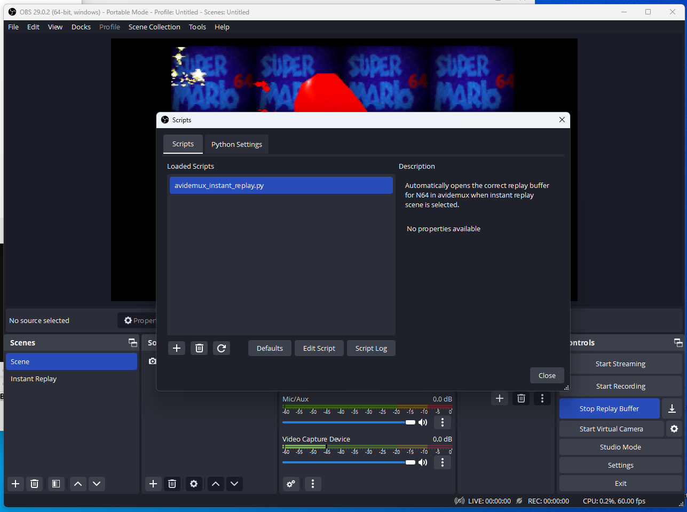

OBS & Avidemux Instant Replay
=============================

This repository documents a way to get instant replays in OBS to open in Avidemux, in order to review gameplay footage down to frame
by frame. It works by automatically taking a replay buffer and opening it in Avidemux when switching to a special scene. When switching
away from that scene, it will also close all Avidemux windows.

This is: a work in progress, technical and complicated. You will likely have to adapt this your own setup quite heavily and will need to
modify the scripts to make them match your own setup.

# Basic Setup

## Dependencies

Download and install all of the following programs:

- OBS: https://obsproject.com/
- Python 3.6: https://www.python.org/downloads/release/python-368/ (latest 3.6 release with installers)
- Avidemux: https://avidemux.sourceforge.net/
- AutoHotKey: https://www.autohotkey.com/
- Notepad++: https://notepad-plus-plus.org/downloads/

Download all scripts available under the following directory somewhere on your computer:
- https://github.com/fmichea/obs-avidemux-instant-replaytree/master/src

## OBS Setup (from scratch)

### Step 1: Create a Scene

First start by setting up the relevant scene with your gameplay. Here is a sample scene
capturing my console:

### Step 2: Configure Replay Buffer

#### Step 2.1: Enable Replay Buffer

The next step, is to setup replay buffer and bind a key combination to save replay buffer.

- Enable Replay Buffer
- Configure where replay buffer will get saved (under "Recording Path")
- Configure maximum replay time (length of replay buffer)

#### Step 2.2: Add a keybinding for saving replay buffer

Search for "replay" in filter, add ``Ctrl+Shift+F7`` as a keybind for "Save Replay" function.

### Step 3: Setup Instant Replay Scene

#### Step 3.1: Create a replay buffer to open in Avidemux

To get the correct capture of Avidemux based on the size of the output, we can create a sample
replay buffer file to open in Avidemux in order to setup the scene.

1. Start Replay Buffer
2. Save Replay Buffer
3. Open Replay Buffer in Avidemux

#### Step 3.2: Create an instant replay scene

In this example, we will just capture Avidemux:

### Step 4: Configure Python Script

Open the Python script in Notepad and check the lines 7 to 14, these are important paths
and configurations you might have to change.

1. ``_INSTANT_REPLAY_SCENE`` should contain the name of the scene responsible for displaying
   the instant replay (the scene which captures Avidemux). In previous screenshots, this scene
   was named "Instant Replay".
2. ``_REPLAY_POSITION`` should contain the path to where the replay buffers are saved.
3. ``_AHK_BINARY`` should contain the path to 
4. ``_INSTANT_REPLAY_START_SCRIPT`` should contain the path to the ``InstantReplay_Start.ahk`` script.
5. ``_INSTANT_REPLAY_STOP_SCRIPT`` should contain the path to the ``InstantReplay_Stop.ahk`` script.
6. ``_AVIDEMUX_BINARY`` should contain the path to the Avidemux binary.

### Step 5: Add script to OBS

#### Step 5.1: Add python path to OBS

Go to menu ``Tools > Scripts`` and open the tab ``Python Settings``.

OBS needs to be pointed to the path where python is installed. This should look something
like this:

#### Step 5.2: Add script to OBS

In the same menu, go to the ``Scripts`` tab and click the ``+`` sign, find the python script
and add it.

# Advanced Setup (Improvements)

In the previous section, I explained the most basic setup possible in this script. In this
section I will mention some of the differences that I made in my real setup (with their
reasoning).

1. Use "Source Record" as the replay buffer.
2. Use the source record filter on a scene which contains gameplay + controller input viewer + timer.
3. Have a webcam+mic scene to layer over both gameplay scene for normal view and instant replay scene.
4. Create a scene for avidemux for retime separate from instant replay scene. Embed it into instant replay scene.

# Known Issues

Since this is still a work in progress, there are still some issues to be ironed out.

## Avidemux shows "Cannot go to previous keyframe" after opening:

Workaround: click "OK", seek to the end of footage manually.

This is likely due to the replay being too short for the keys pressed.

## Avidemux does not open after switching:

Workaround: hit the keybinding for making a new replay buffer (Ctrl-Shift-F7)

The reason for this happening is still unknown, Avidemux will not open until a replay buffer
is created and it seems that sometimes this is not done by pressing the keybind. Pressing it 
again forces the script to move on.

# How does this work?

TODO